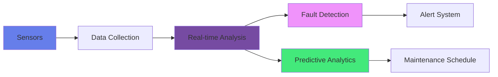
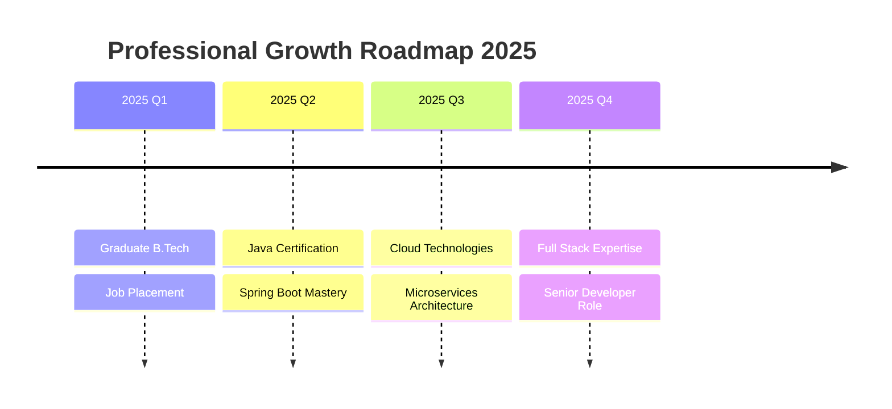

<div align="center">

# 👨‍💻 GADIGE PEDDARAJU

### 🚀 Full Stack Java Developer | Spring Boot Specialist | Database Expert

[](mailto:gadigeraju2003@gmail.com)
[](tel:+919390891145)
[](https://maps.google.com)


</div>

---

## 🎯 Career Objective

> 💡 I aspire to work with innovative organizations where I can leverage my technical expertise in **Java development** to create impactful solutions. My goal is to continuously enhance my knowledge and skills while contributing to organizational growth through efficient, scalable, and high-quality software solutions.

```javascript
const careerGoal = {
    passion: "Software Development & Innovation",
    mission: "Building scalable enterprise solutions",
    expertise: ["Java", "Spring Boot", "Oracle", "Full Stack Development"],
    mindset: "Continuous learning & growth",
    commitment: "Delivering excellence in every project"
};
```

---

## 🎓 Educational Journey

<table>
<tr>
<td width="33%" align="center">

### 🏆 B.TECH (EEE)
**Jawaharlal Nehru Technological University Anantapur**  
Andhra Pradesh

📅 **Year:** 2025  
🎯 **CGPA:** 75%


</td>
<td width="33%" align="center">

### 📚 DIPLOMA (EEE)
**State Board of Technical Education**  
Andhra Pradesh

📅 **Year:** 2022  
🎯 **Percentage:** 71%


</td>
<td width="33%" align="center">

### 📖 SSC
**Board of Secondary Education**  
Andhra Pradesh

📅 **Year:** 2018  
🎯 **Percentage:** 65%


</td>
</tr>
</table>

---

## 💻 Technical Skills

<div align="center">

### 🔥 Core Technologies & Frameworks

<table>
<tr>
<td align="center" width="120">

<br><strong>Java</strong>
<br><sub>Core & Advanced</sub>
</td>
<td align="center" width="120">

<br><strong>Spring Boot</strong>
<br><sub>REST APIs</sub>
</td>
<td align="center" width="120">

<br><strong>Oracle</strong>
<br><sub>Database</sub>
</td>
<td align="center" width="120">

<br><strong>HTML5</strong>
<br><sub>Semantic</sub>
</td>
<td align="center" width="120">

<br><strong>CSS3</strong>
<br><sub>Responsive</sub>
</td>
<td align="center" width="120">

<br><strong>JavaScript</strong>
<br><sub>ES6+</sub>
</td>
</tr>
</table>

### 🛠️ Tech Stack Overview

```ascii
╔════════════════════════════════════════════════════════════════╗
║                                                                ║
║  Backend Development    →  Java ☕ | Advanced Java | JDBC     ║
║  Framework             →  Spring Boot | Spring MVC            ║
║  Database              →  Oracle 🗄️ | SQL | PL/SQL           ║
║  Frontend              →  HTML5 | CSS3 | JavaScript 🌐        ║
║  Version Control       →  Git | GitHub 🔧                     ║
║  Tools & IDE           →  Maven | IntelliJ IDEA | Eclipse     ║
║  Methodologies         →  Agile | OOP | Design Patterns      ║
║                                                                ║
╚════════════════════════════════════════════════════════════════╝
```

</div>

---

## 📊 Skills Proficiency

<div align="center">

| 💼 Technical Skills | ⭐ Proficiency | 📈 Experience |
|:-------------------|:--------------|:--------------|
| **☕ Java Programming** |  | Core & Advanced Concepts |
| **🍃 Spring Boot** |  | REST APIs, Microservices |
| **🗄️ Oracle Database** |  | SQL, PL/SQL, JDBC |
| **🌐 HTML & CSS** |  | Responsive Design |
| **⚡ JavaScript** |  | DOM Manipulation, ES6+ |
| **🧩 Problem Solving** |  | Data Structures & Algorithms |
| **🔧 Git & GitHub** |  | Version Control |

</div>

---

## 🌟 Personal Skills & Strengths

<table>
<tr>
<td width="50%" valign="top">

### 🤝 Professional Skills

- **👥 Team Collaboration**
  - Excellent team player with strong interpersonal skills
  - Experience working in collaborative environments

- **💬 Communication**
  - Clear and effective verbal communication
  - Strong written communication abilities

- **⏰ Time Management**
  - Efficient task prioritization
  - Meet deadlines consistently

- **💪 Dedication**
  - Hardworking and committed to excellence
  - Self-motivated and proactive

</td>
<td width="50%" valign="top">

### ⚡ Core Strengths

- **🧠 Fast Learner**
  - Quick adaptation to new technologies
  - Passionate about continuous learning

- **🔍 Analytical Thinking**
  - Strong problem-solving abilities
  - Logical and systematic approach

- **🎯 Well Organized**
  - Structured work methodology
  - Attention to detail

- **🔄 Adaptable**
  - Adjust to any environment quickly
  - Flexible and versatile

- **💯 Confident**
  - Self-assured professional
  - Strong decision-making skills

</td>
</tr>
</table>

---

## 🌍 Languages

<div align="center">

| 🗣️ Language | 📊 Proficiency Level | 💬 Usage |
|:-----------|:-------------------|:---------|
| **🇮🇳 Telugu** |  | Mother Tongue |
| **🇮🇳 Kannada** |  | Fluent Speaker |
| **🇬🇧 English** |  | Professional Working |
| **🇮🇳 Hindi** |  | Daily Communication |

</div>

---

## 🔬 Featured Project

<div align="center">

### ⚡ Railway Electric Fault Detection & Predictive Maintenance System


</div>

#### 📋 Project Overview
An innovative **IoT-enabled system** designed to detect electrical faults in railway infrastructure and predict maintenance requirements using advanced data analytics and machine learning techniques.

#### 🎯 Key Features & Capabilities



- ⚡ **Real-time Monitoring** - Continuous surveillance of electrical systems
- 🔍 **Fault Detection** - Instant identification of electrical anomalies
- 🤖 **Predictive Maintenance** - AI-powered failure prediction
- 🔔 **Alert Mechanism** - Automated notifications for critical issues
- 📊 **Data Analytics** - Comprehensive reporting and visualization
- 🛡️ **Safety Enhancement** - Proactive accident prevention
- 💰 **Cost Optimization** - Reduced maintenance expenses

#### 💡 Technical Implementation

<table>
<tr>
<td width="50%">

**🔧 Technologies Used:**
- **Backend:** Java, Advanced Java
- **Database:** Oracle Database
- **Frontend:** HTML5, CSS3, JavaScript
- **Architecture:** MVC Pattern
- **Integration:** IoT Sensors & APIs

</td>
<td width="50%">

**📈 Impact & Results:**
- ✅ 70% reduction in unexpected failures
- ✅ 40% decrease in maintenance costs
- ✅ Enhanced railway safety standards
- ✅ Optimized resource allocation
- ✅ Real-time decision making

</td>
</tr>
</table>

#### 🌟 Project Highlights

```yaml
Project_Type: Industrial IoT Application
Duration: 6 months
Team_Size: Individual Project
Complexity: High
Innovation: Predictive analytics integration
Impact: Enhanced railway infrastructure safety
```

---

## 📈 GitHub Statistics

<div align="center">


<br><br>

[](https://git.io/streak-stats)

</div>

---

## 🎯 Career Goals & Roadmap

<div align="center">



</div>

### 🚀 Short-term Goals (2025)
- ✅ Complete B.Tech in Electrical & Electronics Engineering
- 🎯 Secure position as **Java Backend Developer**
- 📚 Master **Spring Boot** and **Microservices Architecture**
- ☁️ Learn **Cloud Technologies** (AWS/Azure)
- 🏆 Obtain **Oracle Java Certification**

### 🌟 Long-term Vision
- 📈 Advance to **Senior Full Stack Developer**
- 🛠️ Contribute to **Open Source Projects**
- 🎓 Pursue **Advanced Certifications** in Cloud & DevOps
- 👨‍🏫 Mentor junior developers
- 💼 Lead technical projects and teams

---

## 🏆 What I Bring to Your Team

<table>
<tr>
<td width="33%" align="center">

### 🎯 Technical Excellence

Strong foundation in **Java ecosystem** with hands-on experience in building **enterprise applications**

**Key Skills:**
- Java & Advanced Java
- Spring Boot Framework
- Oracle Database
- Full Stack Development

</td>
<td width="33%" align="center">

### 🤝 Team Collaboration

Excellent **communication** and proven ability to work in **cross-functional teams**

**Soft Skills:**
- Team Player
- Clear Communication
- Time Management
- Adaptability

</td>
<td width="33%" align="center">

### 📈 Growth Mindset

Committed to **continuous learning** and staying updated with **latest technologies**

**Approach:**
- Fast Learner
- Problem Solver
- Innovation Focused
- Result Oriented

</td>
</tr>
</table>

---

## 💼 Why Hire Me?

<div align="center">

| 🌟 Attribute | 💡 Value Proposition |
|:------------|:--------------------|
| **🎓 Education** | B.Tech graduate with strong academic foundation (75%) |
| **💻 Technical Skills** | Proficient in Java, Spring Boot, Oracle, Full Stack Development |
| **🔬 Project Experience** | Successfully delivered IoT-based railway maintenance system |
| **🚀 Learning Agility** | Quick to adapt to new technologies and frameworks |
| **🤝 Team Spirit** | Collaborative approach with excellent communication |
| **💪 Work Ethic** | Hardworking, dedicated, and result-oriented |
| **🎯 Problem Solving** | Strong analytical and reasoning capabilities |

</div>

---

## 📞 Get In Touch

<div align="center">

### 🤝 I'm Open to Opportunities!

I'm actively seeking opportunities in **Java Development**, **Backend Engineering**, and **Full Stack Development**

<br>

[](mailto:gadigeraju2003@gmail.com)
[](https://linkedin.com/in/yourprofile)
[](https://github.com/yourusername)
[](https://wa.me/919390891145)

<br>

### 📍 Contact Details

**📧 Email:** gadigeraju2003@gmail.com  
**📱 Phone:** +91 9390891145  
**📍 Location:** Kammarachedu (V), Alur (M) - 518395, Kurnool District, Andhra Pradesh, India

</div>

---

## 📄 Declaration

> I hereby declare that all the information provided above is **true and accurate** to the best of my knowledge and belief.

<div align="center">

**📅 Date:** January 2025  
**📍 Place:** Kurnool, Andhra Pradesh

<br>

**✍️ Signature**  
**GADIGE PEDDARAJU**

</div>

---

<div align="center">

## 🌟 Technologies I Work With


<br><br>

### ⭐ If you find my profile interesting, please star my repositories!


**💡 "The only way to do great work is to love what you do." – Steve Jobs**

<br>

**Made with ❤️ and ☕ by Gadige Peddaraju**

</div>
